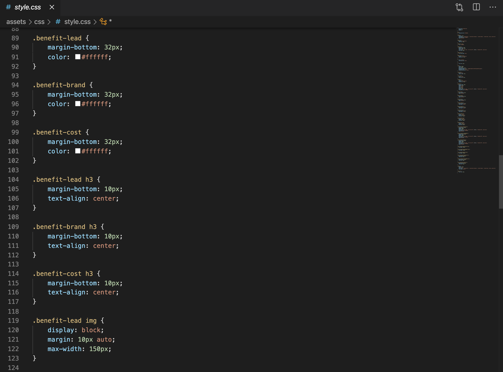

<link rel="stylesheet" href="./assets/css/readme.css">

<h1 class="header">Horiseon</h1>

 Below is a video showing how the code flows more fluently compared to how the previous HTML was written. 

<video controls autoplay>
    <source src="/assets/video/screen-record.mov" type="video/mov">
    </video>

 

To help clean up the HTML and CSS, I consolidated like-terms within CSS. Commits should reflect the before and after. Within the HTML, I've included comments that will be in green to reflect those changes as well.

<section>
    

    Before Consolidation
    

    
    

</section>

<section>

After Consolidation

 I successfully have consolidated over 70 lines of code within css. 

</section>