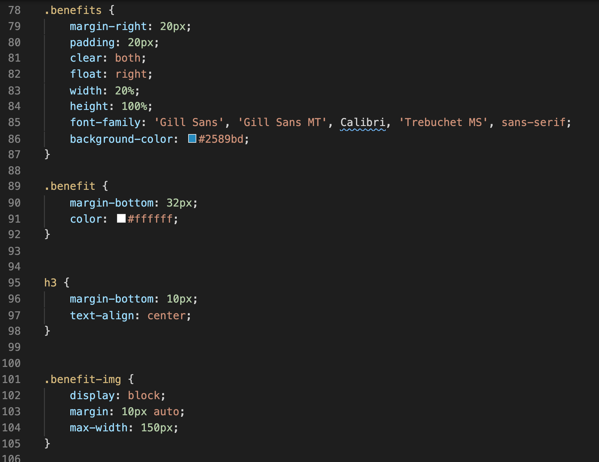

<link rel="stylesheet" href="./assets/css/readme.css">

<h1 class="header">Updates for Horiseon</h1>

To help clean up the HTML and CSS, I consolidated like-terms within CSS. Commits should reflect the before and after. Within the HTML, I've included comments that will be in green to reflect those changes as well.

<h3>After Consolidation

 I successfully have consolidated over 70 lines of code within css. 
